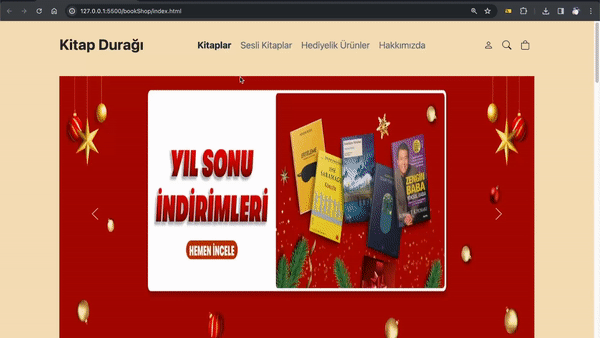

📚 **Kitap Durağı Projesi**

Bu proje, "Kitap Durağı" adlı sanal bir kitapçı web sitesini oluşturmak için HTML, CSS ve Bootstrap kullanılarak geliştirilmiştir. Projenin amacı, kitapları, sesli kitapları ve hediyelik ürünleri kolayca keşfetmeyi sağlayan kullanıcı dostu bir arayüz sunmaktır.

🎨 **Öne Çıkan Özellikler:**
- Anasayfa üzerinde dinamik bir kaydırıcı (slider) ile görsel zenginlik.
- Farklı kategorilere ayrılmış kitap listesi.
- Sepet işlevselliği ve alışveriş sepetindeki ürünleri görüntüleme.
- Bootstrap ikonları ve özel tasarım öğeleri kullanılarak modern ve şık arayüz.

🚀 **Kullanılan Teknolojiler:**
- HTML5, CSS3
- Bootstrap 5
- Bootstrap Icons
- JavaScript (main.js ile yönetiliyor)

🛠️ **Projeyi Başlatma:**
1. Repoyu klonlayın: `git clone https://github.com/avcisalih/bookShop`
2. Proje dizinine gidin: `cd kitap-duragi`
3. Tarayıcıda `index.html` dosyasını açarak projeyi görüntüleyin.

🌐 **Canlı Demo:**
[Kitap Durağı Demo](https://github.com/avcisalih/bookShop)

👩‍💻 **Geliştirici:**
- [Salih Avci](https://github.com/avcisalih)

📝 **Notlar:**
- Proje henüz tamamlanmamıştır. Geliştirme aşamasında olduğu için geri bildirimlere açıktır.
- Katkıda bulunmak isterseniz lütfen bir çekme isteği (pull request) gönderin.

Umarım projemizi beğenirsiniz! 🚀

📸 **Ekran Görüntüleri:**

